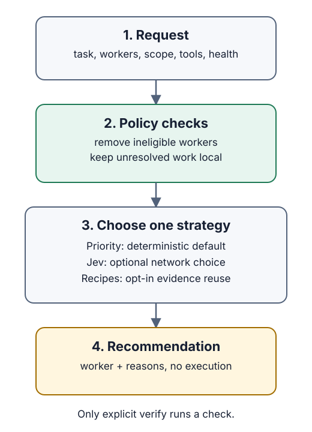
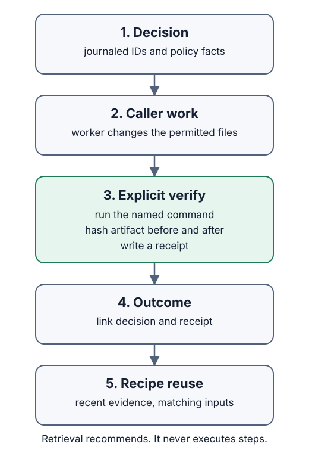

# stooart

**Choose a worker within your rules.** stooart checks a task against the workers you configure and recommends a worker with reasons. You decide whether to hand off the work.

[Get started](#get-started) · [Set up Jev](#set-up-jev) · [Routing rules](#route-a-task) · [Choose a strategy](#optional-strategies) · [Learn from outcomes](#evidence-and-procedure-reuse) · [Contribute](#contribute)

## Get started

The published v0.1.0 release keeps its original package contents. v0.1.1 uses a small root package and matching per-platform npm packages. JSR provides a Deno launcher and requires a native `stooart` executable on `PATH`.

### npm with Node.js

The npm package installs a small Node.js launcher and selects the matching macOS arm64 or Linux x64 executable through optional platform packages. Use Node.js 24 or newer:

```sh
npm install --global @compootor/stooart
stooart --version
```

### JSR with Deno

The JSR package is a Deno launcher and API. Install a native `stooart` executable first. The npm package above is one way to add it to `PATH`.

```sh
deno add jsr:@compootor/stooart
deno run --allow-run=stooart jsr:@compootor/stooart/cli --version
```

The JSR launcher defaults to `stooart` on `PATH`. Its API also accepts an explicit executable path.

To try routing, save the [example request](examples/task.json) as `task.json`, then run:

```sh
stooart route task.json
```

With JSR, use `deno run --allow-run=stooart jsr:@compootor/stooart/cli route task.json`. The command prints a JSON recommendation. The example uses fictional workers, so replace them with workers you can use. Routing needs no API key and never launches a worker.

### Find the right page

| I want to                               | Read                                                                                |
| --------------------------------------- | ----------------------------------------------------------------------------------- |
| Configure workers                       | [Complete request example](examples/task.json)                                      |
| Let Jev choose between eligible workers | [Set up Jev](#set-up-jev), then [try the two-worker check](examples/jev-setup.json) |
| Record checks and reuse procedures      | [Evidence workflow and runnable example](docs/learning.md)                          |
| Prepare or verify a package             | [Release procedure](docs/releasing.md)                                              |

## Agent skills

The repository includes two optional skills. Release packages carry the same files under `skills/`.

| Skill                                  | When to use it                                                                              |
| -------------------------------------- | ------------------------------------------------------------------------------------------- |
| [`delegate`](skills/delegate/SKILL.md) | Route a task among workers you configure, then decide how to act on the recommendation      |
| [`learn`](skills/learn/SKILL.md)       | Record a decision, run an explicit check, link the outcome, and inspect reusable procedures |

To use them with Codex from this checkout, copy the skill directories into your skill folder:

```sh
mkdir -p "${CODEX_HOME:-$HOME/.codex}/skills"
cp -R skills/delegate skills/learn "${CODEX_HOME:-$HOME/.codex}/skills/"
```

For another agent, use its documented skill folder. The skills call the `stooart` executable, so install the CLI or provide its path to the agent. Neither skill grants worker access or runs a worker on its own.

## Set up Jev

**You can use stooart without Jev.** Default priority routing needs no account or API key. Set up Jev when you want an online model to choose between eligible workers.

stooart connects directly to TypeSafe, the service that runs Jev. Its client software is included. **You do not need a separate `jev` command or login.**

### Connect from a terminal

Install stooart first. The commands below work in Bash and zsh on macOS or Linux. Save the [two-worker connection request](examples/jev-setup.json) as `jev-setup.json` in your working folder before the connection check.

1. Create a TypeSafe account and [API key](https://console.typesafe.ai/keys).
2. Run `stooart jev setup`. Paste the key at the hidden prompt and press Enter. From this checkout, use `pnpm dev -- jev setup`. The key does not appear in shell history or command output.

   This saves the key under `~/.config/stooart/credentials` with private file permissions. If `XDG_CONFIG_HOME` is set, stooart uses `$XDG_CONFIG_HOME/stooart/credentials` instead.

3. Run the connection check from a terminal. This uses TypeSafe API quota but does not run a worker.

   ```sh
   stooart route jev-setup.json --jev
   ```

   From the checkout, use `pnpm dev -- route examples/jev-setup.json --jev` without copying the file.

The [connection-check example](examples/jev-setup.json) contains two fictional, eligible workers. You do not need to install them. The check confirms that Jev can return a routing decision.

> [!IMPORTANT]
> **Use the two-worker example for this check.** `examples/task.json` has only one worker, so it skips Jev even with `--jev`. A preferred worker, an ineligible shortlist, or a task kept local can also skip the API.

### Read the result

stooart returns a JSON object with named fields. For the unchanged connection-check example:

| What you see                                                                                                       | What it means                                 | Next step                                                        |
| ------------------------------------------------------------------------------------------------------------------ | --------------------------------------------- | ---------------------------------------------------------------- |
| `workerId` is `ci-test-runner` or `review-and-test-runner`, `reason` mentions the classifier, and no `failureKind` | Jev returned a choice that passed validation  | Replace the fictional profiles with workers you can actually use |
| `executor: "local"`, `failureKind: "low_confidence"`                                                               | Jev responded but was too uncertain to choose | Keep this task with the caller                                   |
| Another `failureKind`, or a command error                                                                          | Setup or the response needs attention         | Open the troubleshooting table below                             |

**Exit code 0 alone does not prove Jev worked.** `local` is a valid routing result, including when a key is missing. Do not repeat calls until Jev picks the worker you prefer.

<details>
<summary><strong>Fix a setup problem</strong> · find your result and next action</summary>

| Result or symptom                                           | What to check                                                                                                                                   |
| ----------------------------------------------------------- | ----------------------------------------------------------------------------------------------------------------------------------------------- |
| `authentication`                                            | Enter a current TypeSafe key in the same terminal and check the account's API access. A key for another model provider will not work.           |
| `quota`                                                     | Check usage and available quota in the TypeSafe account. Repeating the request will not restore quota.                                          |
| `rate_limit`                                                | Wait before trying again; reduce concurrent requests if it repeats.                                                                             |
| `transport` or `timeout`                                    | Check internet access and whether the configured API address is reachable. The request timeout is 10 seconds.                                   |
| `provider`                                                  | Check the service or trusted gateway, then retry later. stooart will not switch providers for you.                                              |
| `malformed_response`                                        | The response could not be used. Check any gateway's compatibility; a response alone does not prove setup is healthy.                            |
| `local` with no `failureKind`, or a priority-based `reason` | Policy may have skipped Jev. Use the unchanged two-worker example and include `--jev`.                                                          |
| Works in a terminal, fails inside an agent                  | The agent process may not have the same environment. See the agent handoff below.                                                               |
| `command failed` with a nonzero exit code                   | Check the working folder, request filename, JSON, flags, and API configuration. Invalid configuration can fail before there is a `failureKind`. |

You can continue without Jev by omitting `--jev`. stooart then uses configured priority.
</details>

<details>
<summary><strong>Keep the connection available</strong> · sessions, native builds, and custom endpoints</summary>

The saved key is available to stooart across terminal sessions and processes. To delete it, run `stooart jev remove`, or `pnpm dev -- jev remove` from the checkout. Keep the key out of repositories and chat.

If `TYPESAFE_API_KEY` is set in the process environment, stooart uses that value instead of the saved key. This is useful for managed agent hosts that inject secrets. If the variable is set to an empty value, stooart treats the key as unavailable and does not fall back to the saved key.

The native executable reads the process environment and the saved credential file. It does not load `.env` files or another CLI's saved login. Development uses the same environment rules. For a built CLI, use the same request with the host binary, such as `./dist/stooart-darwin-arm64 route examples/jev-setup.json --jev`.

Leave `TYPESAFE_BASE_URL` unset for the default service at `https://api.typesafe.ai`. If an administrator supplied a trusted gateway, use its API root; stooart appends `/v1/systemone`. Do not add that endpoint path yourself or silently replace an existing gateway. The configured service receives the API key and routing metadata.

A TypeSafe key grants access to Jev, not to the worker providers in your profiles. Configure and confirm those separately.
</details>

<details>
<summary><strong>Connect an agent</strong> · setup checklist and result handling</summary>

1. **Choose where the key lives.** Run `stooart jev setup` on the host that runs stooart, or set `TYPESAFE_API_KEY` in that host's secret or environment settings. The saved key works across stooart processes for the same user. A terminal export does not update an already-running desktop app. Configure its launching process or restart it from a configured terminal.
2. **Confirm the intended endpoint.** Preserve a deliberately configured gateway. Do not dump environment variables or place credentials in tool arguments, prompts, or logs.
3. **Run the two-worker check** when an API request is within the task's scope. Keep the request unchanged and inspect the returned JSON. A single-worker route is insufficient.
4. **Report `workerId`, `failureKind`, and `reason`.** If the result is `local`, keep control and explain why. If it names a worker, confirm that worker has access and fits the task. Routing does not authorize or perform execution.

When neither source is configured, ask the owner to run `stooart jev setup` or set `TYPESAFE_API_KEY` for the host process. Do not search unrelated files or copy another application's stored credentials.
</details>

## Route a task

```sh
pnpm dev -- route examples/task.json
cat examples/task.json | pnpm dev -- route -
```

A request has two parts: `task` describes the work, and `workers` lists available choices. Keep worker access and availability current.

<details>
<summary><strong>See the routing flow</strong> · request to recommendation</summary>



`route` returns a worker, `local` to keep the task with the caller, or `script` for scoped deterministic work. It never launches a worker or grants file access.
</details>

<details>
<summary><strong>Configure the request</strong> · task and worker field reference</summary>

| Field                                                              | Meaning                                                                                                       |
| ------------------------------------------------------------------ | ------------------------------------------------------------------------------------------------------------- |
| `id`, `kind`, `goal`                                               | Stable identity, phase, and intended behavior                                                                 |
| `acceptance`, `allowedPaths`                                       | Checks and file scope the caller enforces                                                                     |
| `requiredTools`, `unresolved`                                      | Required capabilities and unresolved decisions                                                                |
| `delegationRequested`                                              | Defaults to `false`; explicitly permits research, review, or diagnosis delegation                             |
| `preferredWorkerId`                                                | Exact worker preference; stooart never substitutes another                                                    |
| `allowedProviders`                                                 | Provider allowlist; an empty list permits none                                                                |
| `features`                                                         | Optional `family`, `scope`, `context`, and `proof` enums                                                      |
| `projectId`, `groupId`                                             | Retrieval identity and related-attempt grouping                                                               |
| Profile `id`                                                       | Nonempty, unique worker identifier used by preferences and outcomes                                           |
| Profile `executor`                                                 | Caller-defined name starting with a lowercase letter, followed by lowercase letters, digits, `.`, `_`, or `-` |
| Profile `model`, `provider`                                        | Nonempty identifiers for the configured model and provider                                                    |
| Profile `available`, `tools`, `explicitOnly`, `priority`, `effort` | Caller-supplied availability, capabilities, preference rule, ordering, and optional effort                    |

`local` and `script` are reserved routing results. Configure only model and effort pairs your worker supports.
</details>

| Policy fact                                                                                        | Result                                    |
| -------------------------------------------------------------------------------------------------- | ----------------------------------------- |
| Missing tools, unavailable worker, disallowed provider, duplicate ID, or unmet explicit preference | Reject that worker and include the reason |
| Unresolved or incomplete scope                                                                     | Return `local`                            |
| Research, review, or open diagnosis without explicit delegation                                    | Return `local`                            |
| Scoped deterministic operation                                                                     | Return `script`                           |
| Eligible implementation workers                                                                    | Choose lowest priority, then worker ID    |

<details>
<summary><strong>Track availability</strong> · health and cooldowns</summary>

stooart does not infer live access from an installed CLI. An optional profile `health` object contains a `failure` category plus `observedAt` and `retryAfter` ISO timestamps. Active cooldowns, invalid timestamps, and future observations exclude that profile. Expiry removes the cooldown restriction; it does not prove recovery. Scope profiles to the actual account and provider route, and refresh `available` yourself.
</details>

Every recommendation includes rejected workers and reasons. A preferred worker is exact, never a request to substitute another worker. A recommendation grants no permission and runs no command.

## Optional strategies

Priority routing needs no setup. Use Jev when you have credentials or recipes when you have recorded evidence. **`--jev` and `--recipes` cannot be combined.**

| Strategy               | Add to `route request.json`         | Selection rule                                                   |
| ---------------------- | ----------------------------------- | ---------------------------------------------------------------- |
| **Priority** · default | Nothing                             | Lowest priority number, then worker ID; no network               |
| **Jev** · optional     | `--jev`                             | Ask Jev to choose among up to three eligible workers             |
| **Recipes** · optional | `--recipes --journal journal.jsonl` | Reuse recent, matching procedures supported by verified outcomes |

All three respect policy gates. Priorities, Jev confidence, and observed recipe success rates are not calibrated measures of worker quality.

<details>
<summary><strong>Jev privacy and fallback behavior</strong> · request contents and abstentions</summary>

Follow [Set up Jev](#set-up-jev) to configure credentials. Explicit worker preferences and requests with one eligible worker skip the network call.

| Sent to Jev                                             | Kept out of the request                         |
| ------------------------------------------------------- | ----------------------------------------------- |
| Task kind, required tool labels, optional enum features | Goal, acceptance prose, file paths, project IDs |
| Candidate ID, executor, model, provider, effort         | Journal, procedures, source, worker health      |

Keep IDs and labels free of private content. Priority orders the shortlist locally; it is not sent as a candidate field.

Malformed, inconsistent, out-of-range, or low-confidence responses return `local`. Provider failures do too, with no provider substitution. `failureKind` distinguishes authentication, quota, rate limits, timeout, transport, provider errors, malformed responses, and low confidence. Diagnostics omit provider response bodies. Missing credentials produce an authentication abstention when a network choice is needed.
</details>

## Evidence and procedure reuse

**A reported success becomes reusable evidence only after an explicit check.** Record a decision, do the work, verify a chosen artifact, then link the result.

1. **Route** and save the decision with `--journal`.
2. **Perform the work** through the worker or tool you choose.
3. **Verify** an artifact with a command you explicitly supply.
4. **Record** the outcome, receipt, and optional versioned procedure.

Use `recall` to inspect matching procedures or `--recipes` to opt into their recommendations. Only `verify` executes a check; routing and retrieval never execute procedure text.

[Follow the runnable evidence example →](docs/learning.md#runnable-local-example)

<details>
<summary><strong>See the evidence flow</strong> · work, verification, and reuse</summary>


</details>

<details>
<summary><strong>Use the evidence commands</strong> · input files and journal</summary>

Below, `stooart` means an installed CLI. From the checkout, use `pnpm dev --` in its place. Create `verification.json` and `linked-outcome.json` using the [request formats](docs/learning.md); they are not included fixtures.

```sh
stooart route examples/learning-task.json --journal ./journal.jsonl
stooart verify verification.json --journal ./journal.jsonl
stooart record linked-outcome.json --journal ./journal.jsonl
stooart recall examples/learning-task.json --journal ./journal.jsonl
stooart route examples/learning-task.json --recipes --journal ./journal.jsonl
stooart eval --journal ./journal.jsonl --after 2000-01-01T00:00:00.000Z
```

The cutoff is an example. Choose a past timestamp that separates your recorded training evidence from later decisions.
</details>

<details>
<summary><strong>Understand the evidence</strong> · verification, recipe eligibility, and evaluation limits</summary>

`verify` runs the named command with direct argv execution, a timeout from 1 to 120,000 ms, and the current environment. It hashes the selected file or directory before and after the check. A passing receipt proves that this command passed against that artifact. It does not prove that the check is adequate, that descendants were isolated, or that a third party signed the receipt.

`record --journal` links a decision, attempt, receipt, selected worker, and artifact hash. Only a matching passing receipt supports `verified`. Keep `accepted`, `failed`, `environment_error`, `cancelled`, and `unknown` distinct. Costs are observed values; omitted cost stays unknown.

Recipes require a versioned procedure, at least one verified outcome, matching project/task features and worker configuration, the current policy version, and a receipt younger than 90 days. Retrieval shows verified and failed counts, corrections, checks, and costs. Unknown outcomes stay visible. Routing never runs recipe steps.

Offline `eval` freezes evidence before the supplied cutoff, excludes related task groups from held-out decisions, and reports priority, recipe, and recorded Jev replays. It makes no model calls. Only outcomes for the worker actually selected are observed, so the report is not a causal worker comparison or savings claim.
</details>

<details>
<summary><strong>Know what is stored</strong> · journal integrity and privacy</summary>

New journals use mode 0600 and parent directories use 0700. A directory lock serializes writers. Truncated lines, duplicate IDs, mismatched references, changed procedure versions, and invalid chronology fail closed. Preserve a damaged journal before repairing it.

Decision snapshots omit raw goal text, acceptance prose, and allowed paths. Do not put credentials or private source in task descriptions, procedure text, verifier labels, or legacy logs. Legacy `record --log` files remain separate and never feed recipe routing. The verifier captures stdout and stderr only to hash them; it does not persist raw output.
</details>

Read the full request formats and runnable local exercise in [`docs/learning.md`](docs/learning.md).

<details>
<summary><strong>Keep a simple outcome log</strong> · separate from verified journal evidence</summary>

```sh
pnpm dev -- record examples/outcome.json --log ./outcomes.jsonl
pnpm dev -- history --log ./outcomes.jsonl
```

Without `--log`, the path is `~/.local/state/stooart/outcomes.jsonl`. New files use mode 0600. These records store caller reports, including any `verified` label; they do not prove checks ran and never feed recipe routing. Use `--journal` for linked evidence.
</details>

## Contribute

### Propose a change

Open an issue before changing the routing contract or package layout. For a focused fix, send a pull request that describes the input, the observed result, and the intended result. Test behavior through the CLI or launcher; keep tests independent of internal helper structure. Never include a live TypeSafe key, worker credential, or private journal.

Run `pnpm check` before submitting. If you change native runtime or packaging, also build and test the binary on a supported host. Name that host in the pull request.

### Build from source

Use Node.js 24 or newer and pnpm 12.3.4:

```sh
git clone https://github.com/stoopid-computers/stooart.git
cd stooart
pnpm install --frozen-lockfile
pnpm check
pnpm dev -- route examples/task.json
```

`pnpm check` runs Vite+ formatting, lint, types, GitHub workflow checks, and CLI/launcher tests. Run `pnpm fmt` first if you need to format edited files. To build and exercise the standalone executable for macOS arm64 or Linux x64, run:

```sh
pnpm build:native
pnpm test:native
```

The standalone executable uses scriptc's C backend with embedded QuickJS to run the bundled Effect application. It needs no installed Node.js or Bun. This is scriptc's dynamic mode, not a static translation of the whole application into C. It reads its environment and the saved Jev credential file; it does not load local `.env` files. The npm launcher requires Node.js 24 or newer. The JSR launcher does not download or compile the executable.

See [`docs/releasing.md`](docs/releasing.md) for package checks, provenance, private local archives, checksum verification, and release requirements. Local preview archives are private and must never be published.

stooart is MIT licensed. Embedded dependencies keep their own licenses in [`THIRD_PARTY_NOTICES`](THIRD_PARTY_NOTICES).
